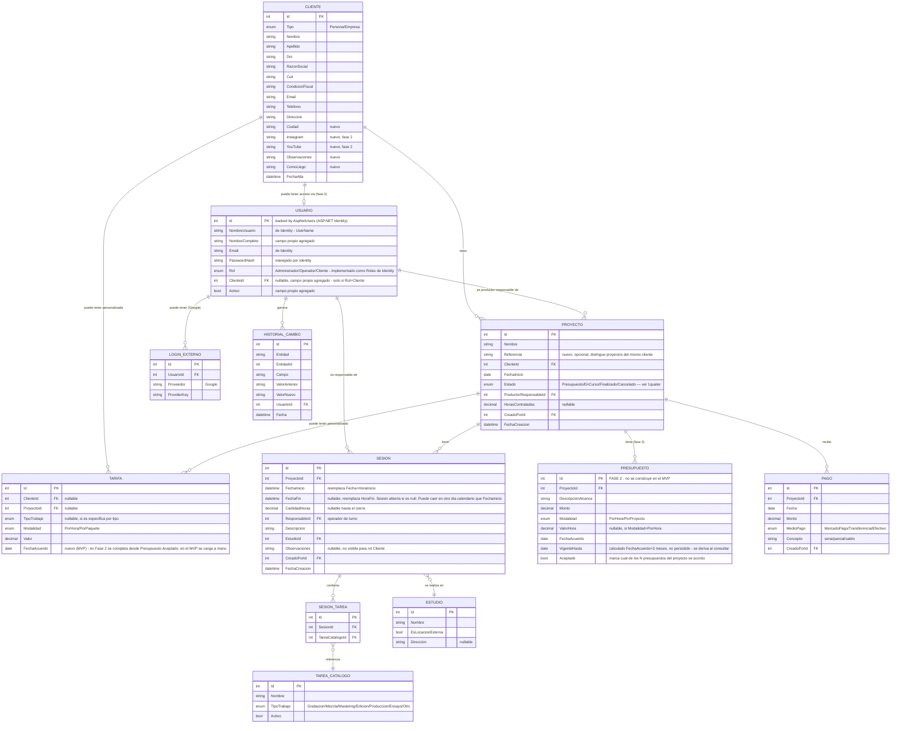

# JCB Estudio — Modelo de Datos (DER)

**Versión:** 1.3
**Fecha:** 2026-07-31
**Depende de:** [requerimientos-funcionales.md](requerimientos-funcionales.md) — ver también [roadmap.md](roadmap.md)
**Contrastado contra:** esquema actual en `Server/Data/Migrations` (única entidad migrada hoy: `Cliente`).

Este documento no fue validado con el cliente (decisión del 2026-07-29 de avanzar sin esa vuelta). Los 3 supuestos que habían quedado abiertos en el Entregable 1 se resuelven acá con criterio de diseño, marcados explícitamente — **no son respuestas del cliente**, sino la interpretación más simple que no cierra puertas.

**Revisión 2026-07-29 (mismo día):** tras comentarios puntuales del cliente sobre el diagrama, se ajustó `Sesion` (fechas que cruzan medianoche, se elimina `Estado`) y se sumó el vínculo opcional `Usuario → Cliente` para el futuro portal de clientes. Ver sección 1bis.

**Revisión 2026-07-29 (achique del MVP):** `Presupuesto` y el módulo de Reportes con exportación quedan para Fase 2. `Tarifa` se carga a mano en el MVP y suma `FechaAcuerdo` propio para no perder la regla de vigencia de 3 meses. Ver sección 1ter.

**Revisión 2026-07-31 (reglas de transición de Estado):** se define cómo pasa un proyecto de un estado a otro (antes era un dropdown libre sin reglas) y se elimina `EnPausa` del enum, que nunca tuvo una regla ni una confirmación del cliente. Ver sección 1quater.

---

## 1. Resolución de los supuestos abiertos (Entregable 1, sección 13)

| Supuesto abierto | Resolución de diseño | Motivo |
|---|---|---|
| Estado `EnPausa` sin confirmar | **Superado, ver sección 1quater (2026-07-31): se eliminó del enum.** | — |
| "Empresa" vs "Razón Social" | Se unifican en un solo campo (`RazonSocial`, ya existente). No se agrega columna "Empresa" separada. | Evita ambigüedad de cuál es la fuente de verdad; si el cliente aclara que son cosas distintas, se agrega en una migración incremental. |
| Cómo diferenciar proyectos del mismo cliente con igual nombre | Se agrega `Referencia` (texto corto, opcional) al proyecto — ej. "Grupo A", "Single 2026". No reemplaza el nombre, lo complementa. | El cliente dijo que el nombre = nombre del cliente; no dijo que no pudiera haber un campo adicional para distinguir. |

---

## 1bis. Ajustes tras revisión del cliente (2026-07-29)

| Comentario del cliente | Ajuste aplicado | Motivo |
|---|---|---|
| "Con la FechaFin de Sesión ya se puede determinar si está abierta o cerrada" | Se elimina el campo/enum `Estado` de `Sesion`. Se deriva: `FechaFin` nulo = abierta, con valor = cerrada. | Evita mantener un dato redundante que puede desincronizarse del campo del que depende. Confirmado que no hay casos de cerrar sin fecha de fin ni de reabrir una sesión. |
| "Una sesión puede arrancar un día y terminar al otro (madrugada)" | `Sesion.Fecha` + `HoraInicio` + `HoraFin` se reemplazan por `FechaInicio` y `FechaFin`, ambos fecha+hora completos. | El modelo anterior asumía que una sesión ocurre dentro de un único día calendario; no soportaba el caso real de sesiones nocturnas que cruzan la medianoche. |
| "El cliente también podrá ser usuario, con su perfil, para ver avances de sus proyectos" | Se agrega el rol `Cliente` a `RolUsuario`, y una referencia opcional `Usuario.ClienteId` (nula para el staff). | Nueva funcionalidad de portal de clientes (Fase 2, solo consulta a nivel resumen). |
| "¿Debería haber una tabla general Persona?" | Se evaluó y se descarta por ahora: se mantiene `Cliente` y `Usuario` como entidades separadas, vinculadas por `Usuario.ClienteId` (opcional). | Decisión del cliente: no mezclar datos comerciales/fiscales con datos de acceso/credenciales, que tienen necesidades de seguridad distintas. |
| "No quiero usar la entidad Alerta por el momento" | Se elimina `Alerta` del DER. El aviso de vencimiento de presupuesto se calcula al vuelo (`FechaAcuerdo + 3 meses` vs. hoy), sin persistir nada. | Decisión del cliente. Evita mantener una tabla sin uso real hasta que haga falta un historial de alertas atendidas/pendientes. |
| "No quiero usar la entidad FotoAdjunta por el momento" | Se elimina `FotoAdjunta` del DER. Adjuntar fotos a sesiones queda completamente fuera de alcance. | Decisión del cliente. |
| "¿Cómo se relaciona Presupuesto con Tarifa? (ej. presupuesto de $100/hora)" | Se agrega `Presupuesto.Aceptado` (bool). Al marcarlo, su `ValorHora` se copia/actualiza en la `Tarifa` del proyecto — que es la que el sistema usa para calcular el importe de cada sesión. `Presupuesto` queda como historial de cotizaciones; `Tarifa` es el valor operativo vigente. | Sin esto, `Presupuesto.ValorHora` y `Tarifa.Valor` eran dos campos independientes sin ninguna conexión, con riesgo de desincronizarse. |
| "El cliente lo da de alta el administrador; al loguearse, se busca coincidencia por DNI para vincular" | El vínculo `Usuario.ClienteId` no se completa a mano: se resuelve buscando `Cliente.Dni` que coincida con el DNI de quien inicia sesión. Si no hay coincidencia, no se vincula y se muestra un aviso amigable ("todavía no estás dado de alta"), no un error técnico. | Define el mecanismo real de vinculación, que antes solo decía "referencia opcional" sin explicar cómo se completaba. |
| "Para autenticación y autorización, usar ASP.NET Identity. También login con Gmail" | `Usuario` deja de ser una tabla 100% a medida: pasa a apoyarse en `AspNetUsers` (ASP.NET Identity), extendida con los campos propios (`NombreCompleto`, `ClienteId`). `PasswordHash` ya lo maneja Identity. Los roles se implementan como Roles de Identity. Se suma login externo con Google. | Decisión técnica del cliente. Evita reinventar manejo de contraseñas/tokens/roles, que Identity ya resuelve de forma probada. |

---

## 1ter. Achique del MVP (2026-07-29)

| Pedido del cliente | Ajuste aplicado | Motivo |
|---|---|---|
| "El presupuesto todavía no tome valor, será hablado, sin un sistema" | `Presupuesto` pasa a **Fase 2** — no se migra ni se construye en el MVP. `Tarifa` se carga a mano al crear el proyecto, y suma su propio campo `FechaAcuerdo` (antes vivía solo en `Presupuesto`) para no perder la regla de vigencia de 3 meses. | Simplifica el MVP: la parte más compleja del modelo (múltiples cotizaciones, `Aceptado`, el puente con Tarifa) se pospone hasta que haga falta de verdad. |
| "La reportería tampoco quiero que se haga en esta etapa; la info debe estar en pantalla, sin exportar a PDF" | No hay módulo de Reportes en el MVP. Las cifras (horas del mes, por cliente, facturación) se muestran directamente en las pantallas de Proyecto/Cliente. El módulo formal con filtros y exportación a PDF queda en Fase 2. | Evita construir un motor de reportes/exportación antes de validar que el resto del sistema funciona en el día a día. |
| "El campo Condiciones especiales de cobro es redundante con Observaciones" | Se elimina `Cliente.CondicionesCobro`. Las condiciones especiales de cobro, si existen, se anotan como texto libre dentro de `Observaciones`. | Ambos eran campos de texto libre sin estructura — mantenerlos separados no aportaba nada que Observaciones no cubriera ya. |

---

## 1quater. Reglas de transición de `EstadoProyecto` (2026-07-31)

`Proyecto.Estado` deja de ser un campo libre editable en el alta/edición. Se elimina `EnPausa` del enum (quedaba en la sección 1 como supuesto sin confirmar y nunca se le asignó una regla). El enum final es `Presupuesto`, `EnCurso`, `Finalizado`, `Cancelado`, con esta lógica:

| Estado | Cómo se llega | Quién lo controla |
|---|---|---|
| `Presupuesto` | Estado inicial de todo proyecto nuevo (todavía sin ninguna `Sesion` cargada). | Automático (servidor). |
| `EnCurso` | Se activa solo al guardarse la primera `Sesion` del proyecto, si el proyecto estaba en `Presupuesto`. | Automático (servidor, en `SesionesController.Post`). |
| `Finalizado` | Acción explícita "Finalizar proyecto" desde el listado de Proyectos. | Manual (staff). |
| `Cancelado` | Acción explícita "Cancelar proyecto" desde el listado de Proyectos. | Manual (staff). |

Regla de precedencia: los estados manuales (`Finalizado`, `Cancelado`) siempre le ganan al cálculo automático — cargar una sesión nueva en un proyecto ya `Finalizado`/`Cancelado` no lo revierte a `EnCurso`. No hay acción para "reabrir" un proyecto finalizado/cancelado en el MVP; si hace falta, se agrega en Fase 2.

---

## 2. Diagrama Entidad-Relación

---

## 3. Cardinalidades clave (en criollo)

- **Cliente → Proyecto**: 1 a N. Un cliente puede tener varios proyectos activos a la vez (ej. distintos grupos a cargo del mismo cliente).
- **Proyecto → Presupuesto** (Fase 2): 1 a N. Un proyecto puede tener varias versiones de presupuesto (distintos alcances cotizados). No se construye en el MVP.
- **Proyecto → Sesión**: 1 a N. Cada sesión pertenece a un solo proyecto (no se reparte trabajo de una sesión entre proyectos).
- **Sesión → Tarea**: 1 a N vía `SESION_TAREA`, porque en una misma sesión se puede grabar batería y después mezclar (dos tipos de tarea en la misma sesión).
- **Tarifa**: puede asociarse a Cliente **o** a Proyecto (ambos FK nullable, pero se valida a nivel de aplicación que tenga exactamente uno de los dos). Esto permite tarifas por defecto de un cliente, que se pueden sobrescribir puntualmente para un proyecto específico.
- **Vencimiento de tarifa** (MVP): no hay entidad `Alerta`. `Tarifa.FechaAcuerdo + 3 meses` se calcula al vuelo contra la fecha de hoy. En el MVP, `Tarifa.FechaAcuerdo` se carga a mano junto con el valor (no hay `Presupuesto` que la dispare).
- **Presupuesto → Tarifa** (Fase 2, no activo en el MVP): no es una relación de base de datos (no hay FK entre las dos tablas), sino una regla de negocio disparada por un evento: cuando se marca `Presupuesto.Aceptado = true`, la aplicación copia `ValorHora` y `FechaAcuerdo` a la `Tarifa` del proyecto (la crea si no existía, o la actualiza si ya existía). `Presupuesto` guarda el historial de lo cotizado; `Tarifa` sigue siendo el valor operativo que usa el cálculo de cada sesión, se cargue a mano (MVP) o desde un Presupuesto aceptado (Fase 2).
- **Usuario ↔ LoginExterno**: esta tabla no se construye a mano — es `AspNetUserLogins`, provista por ASP.NET Identity, que ya sabe guardar el vínculo con Google (u otros proveedores) para cada usuario. Se incluye en el diagrama solo para que se entienda de dónde sale el login con Gmail.
- **HistorialCambio**: tabla genérica (patrón "entidad polimórfica" vía `Entidad` + `EntidadId`) para no crear una tabla de auditoría por cada entidad. Es deuda técnica aceptable a esta escala (equipo de 2-3 usuarios); si el volumen crece, se puede migrar a Audit tables dedicadas o a un paquete tipo `Audit.NET`.
- **Cliente ↔ Usuario**: 1 a 0..1, opcional en ambos sentidos. Un cliente puede no tener ningún usuario asociado (caso de hoy, sin portal), o tener uno para loguearse (Fase 2). Se modela como referencia opcional desde `Usuario` (`ClienteId` nullable) y no como una tabla `Persona` unificada — decisión explícita del cliente para no mezclar datos comerciales con datos de acceso.

---

## 4. Brecha respecto al esquema ya migrado

Lo único migrado hoy es `Cliente` (`20260701212619_InitialCreate` + `20260703013951_ValidacionesCliente`). Para este entregable se necesita una nueva migración que:

1. Agregue a `Cliente`: `Ciudad`, `Instagram`, `YouTube`, `Observaciones`, `ComoLlego`.
2. Incorpore **ASP.NET Identity** (tablas `AspNetUsers`, `AspNetRoles`, `AspNetUserRoles`, `AspNetUserLogins`), extendiendo `AspNetUsers` con `NombreCompleto`, `ClienteId` y `Activo` en vez de crear una tabla `Usuario` 100% a medida.
3. Cree las tablas nuevas del MVP: `Proyecto`, `Tarifa` (con `FechaAcuerdo`), `Estudio`, `Sesion`, `TareaCatalogo`, `SesionTarea`, `Pago`, `HistorialCambio`.

**`Presupuesto` no entra en esta migración** — se crea en una migración aparte cuando se construya en Fase 2.

No se toca ni se renombra nada de lo existente — es 100% aditivo.

---

## 5. Fuera de este entregable (Fase 2, ya anticipado en Entregable 1)

- `FotoAdjunta` y `Alerta`: sacadas del DER por decisión del cliente (2026-07-29). No se modelan hasta que se retomen explícitamente.
- **`Presupuesto`** (decisión 2026-07-29, achique del MVP): queda modelado en este documento pero no se construye. La tarifa se negocia de palabra y se carga a mano en `Tarifa`.
- **Módulo de Reportes con exportación a PDF** (decisión 2026-07-29, achique del MVP): en el MVP la misma información se muestra en pantalla, sin motor de reportes ni exportación.
- Redes sociales (`Instagram`, `YouTube`): campos incluidos en el DER pero de baja prioridad de implementación.
- Portal de clientes: modelado a nivel de dato (`Usuario.ClienteId`, rol `Cliente`) pero las pantallas y permisos concretos se definen en el entregable de wireframes.
- Aprobación de presupuestos y pagos online por parte del cliente (Fase 3): **no modelado**. El propio cliente pidió dejarlo para mucho más adelante.

---

## 6. Próximo entregable

Ver [roadmap.md](roadmap.md) para el detalle completo y el orden de construcción del MVP.
